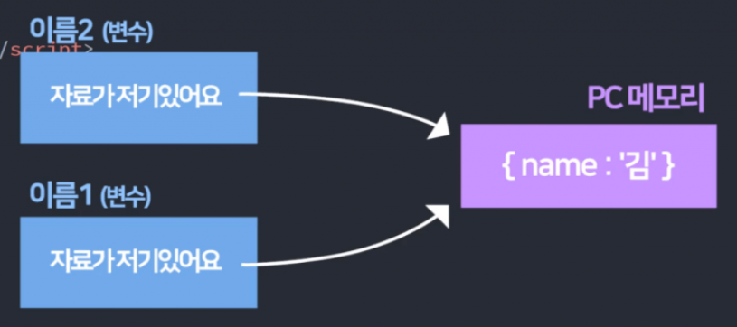
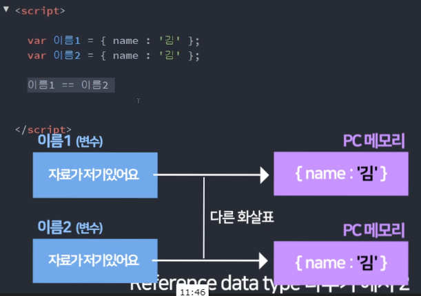
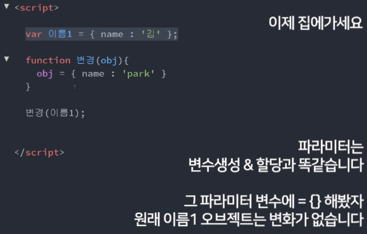

# ES6 공부하기
## 1. spread operator
### 1) Array에 붙이면 대괄호 제거하고 펼쳐줌

```javascript
var arr = ['hello', 'world'];
console.log(...arr); // hello, world
```

### 2) String에 붙이면 문자열 펼쳐줌

```javascript
var str = 'hello';
console.log(...str); // h,e,l,l,o
```

### 3) Array, Object 병합 및 깊은 복사

* 병합(Array)
```javascript
var a = [1,2,3];
var b = [4,5];

var c = [...a, ...b]; //[1,2,3,4,5]
```


* 깊은 복사(Array)
```javascript
//문제점
var a = [1,2,3];
var b = a; //그냥 등호로 복사하면 값을 공유함

a[3] = 4; //a만 값 추가했는데 b도 추가되어 있음

//독립적인 값을 가지려면?
var a = [1,2,3];
var b = [...a]; 

a[3] = 4; //a만 추가됨! a = [1,2,3,4], b = [1,2,3]
```


* 병합(Object)
```javascript
var o1 = {a:1, b:2};
var o2 = {...o1, c:3}; //{a:1, b:2, c:3}
```


* 깊은 복사(Object)
```javascript
//독립적인 값을 가지려면?
var o1 = {a:1, b:2};
var o2 = {...o1};

//중복된 값이 있을 경우?
var o1 = {a:1, b:2};
var o2 = {...o1, a:2}; //{a:2, b:2}
//중복한 값이 있으면 뒤에 온 값으로 덮어씌워짐
```


### 4) 함수 파라미터 넣을 때

```javascript
function add(a,b,c){
    console.log(a + b + c);
}
var arr = [10, 20, 30];
add.apply(undefined, arr); //옛날 방식
add(...arr); //요즘 방식
```

### 5) arguments(옛날문법)

```javascript
function 함수(a,b,c){
  console.log(arguments[0])
  console.log(arguments[1])
  console.log(arguments[2])
}

함수(2,3,4);
```

## 2. rest 파라미터
### 1) 사용법
```javascript
function test(a,b, ...rest){
  console.log(rest)
}

test(1,2,3,4,5,6,7); //[1,2,3,4,5,6,7]
```
* 파라미터들 중에서 가장 마지막에 넣어줘야 함.
* ...rest는 한 번만 사용가능.

### 2) rest vs spread 구분
* 파라미터 자리에 ... 붙으면 rest 나머지는 spread

### 3) 연습문제
```javascript
  var a = [1,2,3];
  var b = ['you','are'];
  var c = function(a,b){
    console.log([[...a], ...[...b]][1])
  }
  c(a,b); //you
```
* 3-1 spread 응용
  * [...a] => [1,2,3]
  * [...b] => ['you', 'are']
  * ...[...b] => you, are
  * [[...a], ...[...b]] => [[1,2,3], 'you', 'are']

<br/>

```javascript
console.log(['b','c','a'].sort()); //['a','b','c']

function sorting(str){
  return [...str].sort());
} //문자열을 array로 바꿔줌

sorting('bear'); //['a','b','e','r']
)
```
* 3-2 문자열 정렬
  * 문자열 정렬을 위해 array로 바꿔준 후 sort()

<br/>

  ```javascript
  count('aacbbb');
  //{a:2,b:3,c:1}

  function count(str){
    let result = {};
    [...str].forEach(function(a){
      if(result[a] > 0){
        result[a] = result[a]+1;
      }else{
        result[a] = 1;
      }    
    })
  }
  ```      
  * 3-3 글자 카운팅 함수
    * 같은 글자가 있으면 +1, 없으면 1

### 4) 기타
#### 4-1) Primitive 자료형
```javascript
var 이름1 = '김';
var 이름2 = 이름1;
이름1 = '박';

console.log(이름1); //'박'
console.log(이름2); //'김'
```
<br/>

#### 4-2) Reference 자료형(Array, Object)



```javascript
var 이름1 = { name : '김' };
var 이름2 = 이름1;
이름1.name = '박';

console.log(이름1.name); //'박'
console.log(이름2.name); //'박'
```
* 특징1
  * {name:'김'} 이라는 데이터 자체가 복사된 것이 아니라 이름1의 위치를 참조하는 것. 그래서 이름1이 바뀌었을 때 이름2의 값도 달라진 것.

  * 값을 복사한 것이 아니고 같은 공유하는 것 뿐이기 때문에 array, object 복사할 때는 주의해야 함.

<br/>



* 특징2
  * 이름1 == 이름2 는 보이는 데이터는 갔지만 데이터를 저장한 것이 아니기 때문에 false가 출력된다. 둘은 각각 다른것.  

<br/>



* 특징3
  * 이름1과 변경(obj)의 파라미터는 각각 다른 object를 가리키고 있는 것이기 때문에 변경 시켜도 이름1에는 변함 없음. 
  * obj에 새로운 오브젝트를 할당시켜준 것과 같음.