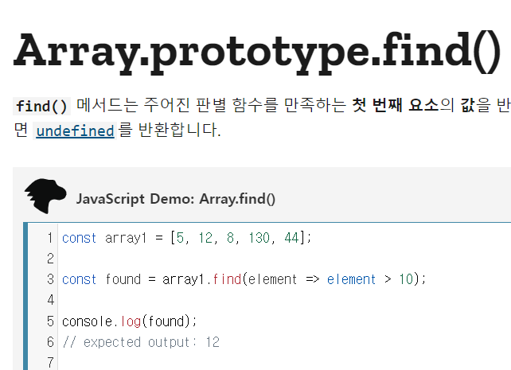
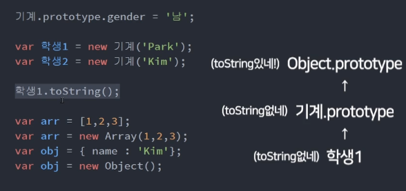

# ES6 공부하기
## 1. constructor
### 1) 사용법
* 객체지향1. object 생성기능
  * this: 생성자에서 새로 생성되는 object(instance)
  * construntor: object 생성기계(생성자) 

```javascript
//첫글자는 대문자로 적음 
function Student(name){
  this.name = name;
  this.age = 15;
  this.sayHi = function(){
    console.log('안녕하세요' +  this.name + '입니다');
  }
}

const st = new Student('Kim');
// Student {name: 'Kim', age: 15}
const st2 = new Student('Park');
// Student {name: 'Park', age: 15}
```

## 2. prototype(상속:유전자)
### 1) prototype 이란?
* 생성자를 통해 속성들을 물려받음(constructor) 
* constructor.prototype

```javascript 
function Student(name){
  this.name = name;
  this.age = 15;
  this.sayHi = function(){
    console.log('안녕하세요' +  this.name + '입니다');
  }
}
Student.prototype.gender = '남';

const st = new Student('Kim');

console.log(st.gender); //'남'
//st안에 gender를 찾아보고 없으면 부모 유전자(prototype)에는 있는지 찾음

st.toString();
//st안에는 toString이라는 함수가 없지만 함수 기능을 한다.(내장함수) st 부모의 prototype을 찾은 것. 
```
* 부모(constructor)에 값을 추가하면 모든 자식들이 물려받기 가능.
* Student 자체에 값이 추가되진 않았지만 상속받은 자식이 값을 사용할 수 있음.



* javascript 내장함수들이 작동하는 원리와 같음.<br/> ex) st.toString();
* 자식에겐 없어도 부모에게 있는 함수라서 내장함수를 자식들이 사용할 수 있는 것.
* array의 부모에게 find 함수 유전자가 있어서 사용 가능한 것.

```javascript
var arr = [1,2,3];
var arr = new Array(1,2,3);
//array가 만들어지는 방식
//array라는 부모를 상속해서 만들어지는 것
```



* 부모에게 없다면 그 부모의 부모에게 있는지 찾음. 그래서 상위 부모인 object의 prototype에 있는 toString을 사용하게 되는 것

### 2) 특징
* prototype은 함수에만 생성됨
* 부모의 prototype을 검사하고 싶을땐 `__proto__`<br/>
(내 바로 위 부모)
  * ex)`학생1.__proto__`
* 모든 자식들은 `__proto__` 사용가능
* `__proto__`이용해서 자식에 부모님 강제 등록도 가능(이렇게 사용하진 않음) 
```javascript
var 부모 = {name: 'Kim'};
var 자식 = {};

자식.__proto__ = 부모;
자식.name;
```