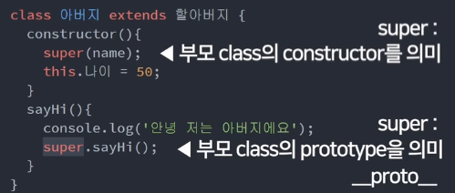

# ES6 공부하기
## 1. class(객체지향 문법)
### 1) 사용법 
* Object 여러개 만들기 위해 사용함
* es6에서 constructor 만든는 법

```javascript
class parent {
constructor(){
    this.name = 'Kim';
    this.sayHi = function(){
      console.log("Hello");
    } //함수를 추가하고 싶을때 방법1: constructor에 추가
  }
   sayHi(){
       console.log("Hello");
  } //여기에 쓰면 상속되지 않음. child 객체에 추가 안됨. parent.prototype에 추가됨.
  //super 사용하면 쓸 수 있음.
}

var child = new parent();
```
* child.`__proto__` = parent.prototype
* child.`__proto__` = childObject.getPrototypeOf(child); (parent의 prototype을 알 수 있음)

## 2. extends
* 유사한 class를 하나 더 만들고 싶을 때(class 상속)

```javascript
class first {
 constructor(name){
   this.성 = 'Kim';
   this.이름 = name;
  }
  sayHi(){
    console.log("Hello");
  } //super 덕분에 seconds1도 사용 가능.
}

var first1 = new first('dasom');
//first {성: 'Kim', 이름: 'dasom'}

class seconds extends first {
  constructor(name){
    super(name); 
    //물려받는 class의 constructor라는 뜻
    //this.성 = 'Kim';
    //this.이름 = name;
    this.나이 = 20;
  }
}

var seconds1 = new seconds('dasom');
//seconds {성: 'Kim', 이름: 'dasom', 나이: 20}

seconds1.sayHi(); //Hello
//원래는 first의 함수여서 상속되지 않아서 사용 못하는데 super로 상속받아서 sayHi 까지 사용가능 
```



* constructor() 안에서 super()를 사용할 경우 부모 클래스의 constructor를 의미
* constructor() 밖에서 super()를 사용할 경우 부모 클래스의 prototype을 의미<br/>
(부모.prototype.sayHi())