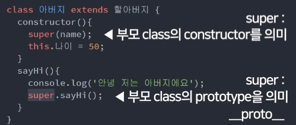

# ES6 공부하기
## 1. class(객체지향 문법)
### 1) 사용법 
* Object 여러개 만들기 위해 사용함
* es6에서 constructor 만든는 법

```javascript
class parent {
constructor(){
    this.name = 'Kim';
    this.sayHi = function(){
      console.log("Hello");
    } //함수를 추가하고 싶을때 방법1: constructor에 추가
  }
   sayHi(){
       console.log("Hello");
  } //여기에 쓰면 상속되지 않음. child 객체에 추가 안됨. parent.prototype에 추가됨.
  //super 사용하면 쓸 수 있음.
}

var child = new parent();
```
* child.`__proto__` = parent.prototype
* child.`__proto__` = childObject.getPrototypeOf(child); (parent의 prototype을 알 수 있음)

## 2. extends
* 유사한 class를 하나 더 만들고 싶을 때(class 상속)

```javascript
class first {
 constructor(name){
   this.성 = 'Kim';
   this.이름 = name;
  }
  sayHi(){
    console.log("Hello");
  } //super 덕분에 seconds1도 사용 가능.
}

var first1 = new first('dasom');
//first {성: 'Kim', 이름: 'dasom'}

class seconds extends first {
  constructor(name){
    super(name); 
    //물려받는 class의 constructor라는 뜻
    //this.성 = 'Kim';
    //this.이름 = name;
    this.나이 = 20;
  }
}

var seconds1 = new seconds('dasom');
//seconds {성: 'Kim', 이름: 'dasom', 나이: 20}

seconds1.sayHi(); //Hello
//원래는 first의 함수여서 상속되지 않아서 사용 못하는데 super로 상속받아서 sayHi 까지 사용가능 
```



* constructor() 안에서 super()를 사용할 경우 부모 클래스의 constructor를 의미
* constructor() 밖에서 super()를 사용할 경우 부모 클래스의 prototype을 의미<br/>
(부모.prototype.sayHi())

## 3. setter/getter

```javascript
  var person = {
    name: 'Park',
    age: 30,
    get nextAge(){
      return this.age + 1
    }, //꺼내쓰는 함수
    set setAge(age){
      this.age = parseInt(age);
    } //변경하는 함수
  }

  person.setAge = '20';
  person.nextAge; //21

  console.log(person); // {name:'Park', age:20, ...}
```

* get 함수: return 필수
* set 함수: 파라미터 1개 필수

## 4. 연습문제
### 1) 직접 class 구조
```javascript
//유사한 오브젝트 복사
var 강아지1 = { type : '말티즈', color : 'white' };
var 강아지2 = { type : '진돗개', color : 'brown' }; 

class Dog {
  constructor(타입, 칼라){
    this.type = 타입;
    this.color = 칼라;
  }
}
var 강아지1 = new Dog('똥개', 'black');
```

### 2) 직접 class 구조
```javascript
//강아지와 유사한 오브젝트 복사(age 추가)
var 고양이1 = { type : '코숏', color : 'white', age : 5 };
var 고양이2 = { type : '러시안블루', color : 'brown', age : 2 }; 

class Dog {
  constructor(타입, 칼라){
    this.type = 타입;
    this.color = 칼라;
  }
}

class Cat extends Dog {
  constructor(타입, 칼라, 나이){
    super(타입, 칼라);
    this.age = 나이;
  }
}

var 고양이1 = new Cat('동네고양이', 'white', 5);
```
* 고양이 오브젝트에 필요한 파라미터를 constructor()안에 다 나열해주시면 되고
Dog로부터 물려받은 속성들에 필요한 파라미터들은 그대로 super() 안에 넣어주면됨. 
혹은 그냥 super()함수는 Dog의 constructor()를 그대로 복붙했다고 생각하기

### 3) 고양이 강아지 object들에 기능 추가
```javascript
//모든 고양이 강아지는 한살먹기() 함수 사용 가능
//(1) 한살먹기 함수는 강아지 class로부터 생성된 오브젝트가 사용하면 콘솔창에 에러를 출력해주어야합니다. 
//(2) 한살먹기 함수는 고양이 class로 부터 생성된 오브젝트가 사용하면 현재 가지고있는 age 속성에 1을 더해주는 기능을 실행해야합니다.

class Dog {
  constructor(타입, 칼라){
    this.type = 타입;
    this.color = 칼라;
  }
  한살먹기(){
    if( this instanceof Cat) {
    this.age++
    }
  }
}

class Cat extends Dog {
  constructor(타입, 칼라, 나이){
    super(타입, 칼라);
    this.age = 나이;
  }
}
```
* a instanceof b 는 a가 b로부터 생성된 오브젝트인지 아닌지를 true/false로 알려주는 연산자
* 한살먹기()라는 함수를 만들고 this.age++를 해주는 기능을 넣었는데 이 기능은 this가 instanceof Cat인 경우에만 실행하도록 if문을 추가했음.
그럼 이제 Cat으로 부터 생성된 오브젝트들만 한살먹기() 내부 기능을 사용가능.

### 4) get/set 이용
```javascript
//(1) 모든 Unit의 인스턴스는 공격력, 체력 속성이 있으며 기본 공격력은 5, 기본 체력은 100으로 설정되어 있어야 합니다.
//(2) 모든 Unit의 인스턴스는 전투력을 측정해주는 battlePoint라는 getter가 있습니다.
//console.log( 인스턴스.battlePoint ) 이렇게 사용하면 현재 공격력과 체력을 더한 값을 콘솔창에 출력해주어야합니다.
//(3) 모든 Unit의 인스턴스는 heal이라는 setter가 있습니다.
//인스턴스.heal = 50 이렇게 사용하면 체력 속성이 50 증가해야합니다. 

class Unit {
  constructor(){
    this.체력 = 100;
    this.공격력 = 5;
  }
  get battlePoint(){
    return this.체력 + this.공격력;
  }
  set heal(a){
    this.체력 = this.체력 + a; 
  }
};

var 쎈애 = new Unit();

console.log(쎈애.battlePoint);
쎈애.heal = 50;
```
* Unit이라는 class를 만들고 constructor에는 체력과 공격력을 기본으로 부여. 
* battlePoint()라는 함수를 만들고 이건 체력과 공격력을 합해서 출력하는 기능을 만듦. 
* get을 붙여서 소괄호없이도 이용가능하게 만듦. 
* heal() 이라는 함수를 만들었고 파라미터로 숫자를 입력하면 체력이 그만큼 증가. 
* set을 붙여서 소괄호없이도 이용가능하게 만듦.