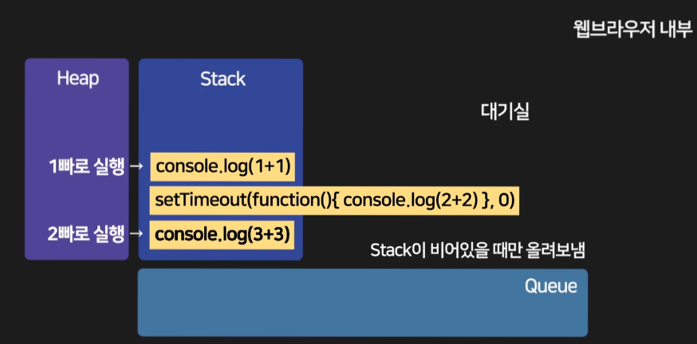

# ES6 공부하기
## 1. Stack, Queue를 이용한 웹브라우저 동작원리



* javascript는 싱글스레드, 동기적으로 실행되는 언어
* 웹 브라우저는 html,css,js를 실행시켜주는 프로그램
* stack이란 공간은 한개만 존재하며 실행코드를 쌓아두고 한줄씩 실행시킴
* ajax요청, 이벤트리스너, setTimeout등의 처리가 오래걸리는 코드는 바로 Stack에 쌓지 않고 잠시 보류한 후 완료되는 시점에 Stack으로 보냄
* 처리가 오래걸리는 코드가 실행준비가 되는 시점에 Queue에 줄세우고 Stack이 텅 빈 시점에 차례로 옮겨서 실행시킴

## 2. 동기/비동기
### 1) 정의
* 동기: 한 줄씩 순서대로 처리
* 비동기: 오래걸리는 작업이 있으면 제껴두고 다른거부터 처리하는 방식(자바스크립트 실행하는 브라우저 덕분에 가능)
<br>ex) setTimeout, 이벤트리스너, ajax 등
* 평소에 자바스크립트는 오래걸리는 연산을 만나면 멈추고 기다림(동기식처리)
* Web API와 연관된 비동기를 지원하는 함수들을 만나면 작업이 오래걸릴 때 다른거부터 실행함(비동기식처리)

### 2) 비동기 상황에서 순차적으로 실행하려면?
* 콜백함수(함수안에 함수)를 사용함
* 콜백함수는 동기/비동기가 아니고 그냥 함수 디자인 패턴일 뿐
```javascript
//이런 문법들을 써야 비동기처리 가능
//결과: 1 (1초 쉬고) 2
console.log(1);
setTimeout(() => {console.log(2)}, 1000); 

//콜백함수 디자인
function 첫째(a){
console.log(1);
a();
}

function 둘째(){
console.log(2);
}

첫째(둘째);

//콜백함수 문제점
첫째(function (){
  둘째(function(){
    셋째(function(){

    })
  })
})
```
* 콜백함수의 문제점을 해결하여 더 쉽게 쓰기 위해 필요한 Promise 패턴
```javascript
첫째함수().then(function(){
   그 담에 실행할거
}).then(function(){
   그 담에 실행할거
});
```

## 3. Promise
> 콜백 대신 예쁜 코드
> 성공/실패의 경우에 맞춰 각각 다른 코드 실행 가능
### 1) 기본 사용법
```javascript
//성공,실패 판정기계
var 프로미스 = new Promise(function(resolve, reject){
  //성공 resolve();
  //실패 reject();
  var 어려운연산 = 1+1;
  resolve(어려운연산); //성공결과가 then 함수까지 전달됨
}); 

프로미스.then(function(결과){
  //성공일 경우 실행할 코드
  console.log('성공');
  console.log(결과);
}).catch(function(){
  //실패일 경우 실행할 코드
  console.log('실패');
})
```
* 일반 콜백함수는 '1번 실행 후 2번 실행해주세요'라면 Promise는 '1번실행 후 성공시 2번 실행해주세요', '실패시 3번 실행해주세요' 까지 가능
* Promise는 동기를 비동기로 만들어주는 코드가 아님. 비동기적 실행과 전혀 상관이 없음(비동기적인 함수를 사용해야 비동기 처리임:setTimeout 등)
* 그냥 원래 자바스크립트는 평상시엔 동기적으로 실행이 되며 비동기 실행을 지원하는 특수한 함수들 덕분에 가끔 비동기적 실행이 될 뿐
* Promise는 그냥 콜백함수 디자인의 대체품일 뿐
* Promise가 적용된 곳들(fetch(), JQuery.ajax())
* Promise는 순차적 실행을 위해 콜백함수 대신 쓸 수 있는 코딩패턴

### 2) Promise의 3가지 상태
* resolved: 성공
* pending: 판정 대기중
* rejected: 실패

### 3) 사용예시
* 1초 후 성공하는 Promise, 성공시 특정 코드 실행
```javascript
var 프로미스 = new Promise(function(resolve, reject){
  setTimeout(function(){
    resolve();
  }, 5000);
}); 

프로미스.then(function(결과){
  console.log('성공');
}).catch(function(){
  console.log('실패');
})
```
## 4. async/await
> 함수 앞에 async를 붙이면 함수 실행 후 Promise 오브젝트가 남음
### 1) async 기본 사용법
```javascript
async function plus(){
return 1 + 1;
}

plus().then(function(res)){
    console.log(res);
});
```
* async만 붙이면 promise를 반환하기 때문에 promise보다 간단하게 사용가능
* 단점은 성공만 가능

### 2) async function 안에서 쓰는 await 
```javascript
async function plus(){
  var 프로미스 = new Promise(function(resolve, reject){
    var 어려운연산 = 1 + 1;
    resolve(어려운연산);
  });

  try {
    console.log('성공');
    var result = await 프로미스; 
    //프로미스 해결되기 까지 기다리란 뜻
    console.log(result); //2(어려운연산)
  } catch {
    console.log('실패');
  }

  //위의 코드랑 같은 코드
  // 프로미스.then(function()){
  //   console.log('성공');
  // });
}
```
* async function 안에서의 await는 then 대신 사용 가능
* await은 프로미스 실패시 에러나고 멈춤
* 이런 에러를 방지하려면 try{} catch{}로 감싸기


> 예제는 html 파일에서 확인