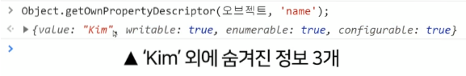

# ES6 공부하기
## 1. 반복문 종류
```javascript
var obj = {name:'kim', age:30};

//기본 for 반복문
for(var i = 0; i < 3; i++){
} 

//forEach() - Array 전용
[1,2,3].forEach();

//for in - Object 전용
for(var key in obj){}

//for of - iterable 전용
for(var key of ){}
```

### 1) for in
```javascript
var obj = {name:'kim', age:30};

//for in - Object 전용
for(var key in obj){
  console.log(obj[key]); //kim 30
   console.log(key); //name age
}
```

* obj 갯수만큼 반복되어 데이터 꺼냄
* enumerable한 것만 반복해줌(셀 수 있는지 여부)
* 일반 자료들은 항상 enumerable이 true가 기본값
* 부모의 prototype도 반복해줌

### 2) for of
```javascript
//array
var array = [2,3,4,5];
for(var data of array){
 console.log(data);
}

//string
var string = 'apple';
for(var data of string){
  console.log(data)
}

```
* Array, 문자, arguments, NodeList, Map, Set 자료형에 쓸 수 있음
* iterable한 자료형에만 사용가능

### 3) for of 문제
> Q. key값 마지막 부분에 오타를 섞어놨습니다. key값 마지막에 한자릿수 숫자가 섞여있으면 그걸 다 제거하고 싶습니다. (마지막 글자가 숫자인지 판단하는 방법도 잘 찾아봐야겠군요)
* 연습용 하드코딩 반복문
```javascript
let 오브젝트 = {
  name1 : 'chair'
}
//마지막글자를 숫자로변환했을 때 NaN이 안나오면 (숫자면)
if (isNaN(parseInt('name1'.slice(-1))) == false ) {
    let newValue = 오브젝트['name1'];
    let newKey = 'name1'.slice(0, -1);  //맨 뒷 문자 제거 방법
    오브젝트[newKey] = newValue;

    delete 오브젝트['name1']; //원래있던 key 제거
}
console.log(오브젝트);
```

* 최종 코드
```javascript
var products = [
  {
    name1 : 'chair',
    price1 : 7000,
  },
  {
    name2 : 'sofa',
    price : 5000,
  },
  {
    name1 : 'desk',
    price3 : 9000,
  },
]; 

let newValue;
let newKey;

for (let item of products) {
  for (let key in item) {
     //마지막글자를 숫자로변환했을 때 NaN이 안나오면 (숫자면)
     if (isNaN(parseInt(key.slice(-1))) == false ) {
       newValue = item[key];
       newKey = key.slice(0, -1); 
       item[newKey] = newValue;
       delete item[key]; 
     }
  }
}

console.log(products)
```
* isNaN(parseInt('123')) 
이걸 사용하면 대충 이게 숫자형 문자인지 판단해줌
NaN은 문자에 숫자연산하려고하면 나오는 이상한 자료형이며 isNaN은 NaN인지 판정해줌
그래서 저기에 '123' 이걸 집어넣으면 false
그래서 저기에 '가나다' 이걸 집어넣으면 true

* 작업순서
1. name1 여기 가장 뒷자리 문자가 숫자인지 확인

2. 그게 숫자면 일단 newValue, newKey를 만듦

3. newKey는 맨 뒷 문자를 제거
그리고 기존 오브젝트에 { newKey : newValue } 데이터를 추가

4. 마지막으로 delete 키워드 쓰면 object에 있던 property 지울 수 있음
